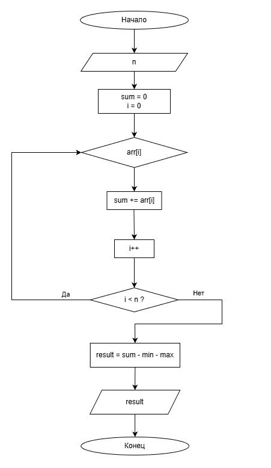

# Домашнее задание к работе 11

## Условие задачи
С одномерным массивом, состоящим из n вводимых с клавиатуры положительных и отрицательных цельных чисел выполнить следующие вычисления: сумму элементов массива, за исключением минимального и максимального значения.

## 1. Алгоритм и блок-схема

### Алгоритм
1. **Начало**
2. Объявить переменные:
   - `n` - размер массива (1 ≤ n ≤ 100)
   - `arr[100]` - массив для хранения чисел
   - `sum` - общая сумма всех элементов массива
   - `min` - минимальный элемент массива
   - `max` - максимальный элемент массива
   - `result` - итоговая сумма (без min и max)
3. Ввести исходные данные:
   - Ввести размер массива `n` с проверкой диапазона
   - Ввести `n` чисел в массив
4. Инициализировать переменные:
   - `sum = 0`
   - При первом вводе элемента: `min = max = arr[0]`
5. Выполнить обработку массива:
   - Для каждого элемента массива:
     - Добавить значение элемента к `sum`
     - Если текущий элемент меньше `min`, обновить `min`
     - Если текущий элемент больше `max`, обновить `max`
6. Вычислить результат:
   - `result = sum - min - max`
7. Вывести результаты:
   - Общую сумму всех элементов
   - Минимальный элемент
   - Максимальный элемент
   - Итоговую сумму (без min и max)
8. **Конец**

### Блок-схема


## 2. Реализация программы

```c
#define _CRT_SECURE_NO_DEPRECATE
#include <stdio.h>
#include <locale.h>

void task();

int main() {
    setlocale(LC_ALL, "");

    task();
    return 0;
}

void task() {
    int n;
    printf("Введите размер массива (1-100): ");
    scanf("%d", &n);

    int arr[100], sum = 0, min, max;

    printf("Введите %d чисел: ", n);
    for (int i = 0; i < n; i++) {
        scanf("%d", &arr[i]);
        if (i == 0) {
            min = max = arr[0];
        }
        else {
            if (arr[i] < min) min = arr[i];
            if (arr[i] > max) max = arr[i];
        }
        sum += arr[i];
    }

    int result = sum - min - max;

    printf("Общая сумма: %d\n", sum);
    printf("Минимальный элемент: %d\n", min);
    printf("Максимальный элемент: %d\n", max);
    printf("Сумма за исключением min и max: %d\n", result);
}
```

## 3. Результаты работы программы

### Пример 1:
```
Введите размер массива (1-100): 5
Введите 5 чисел: 10 -5 3 8 -2
Общая сумма: 14
Минимальный элемент: -5
Максимальный элемент: 10
Сумма за исключением min и max: 9
```

### Пример 2:
```
Введите размер массива (1-100): 7
Введите 7 чисел: 1 2 3 4 5 6 7
Общая сумма: 28
Минимальный элемент: 1
Максимальный элемент: 7
Сумма за исключением min и max: 20
```

### Пример 3:
```
Введите размер массива (1-100): 3
Введите 3 чисел: -10 0 10
Общая сумма: 0
Минимальный элемент: -10
Максимальный элемент: 10
Сумма за исключением min и max: 0
```

## 4. Информация о разработчике

Маркина Елена, группа бТИИ-251
